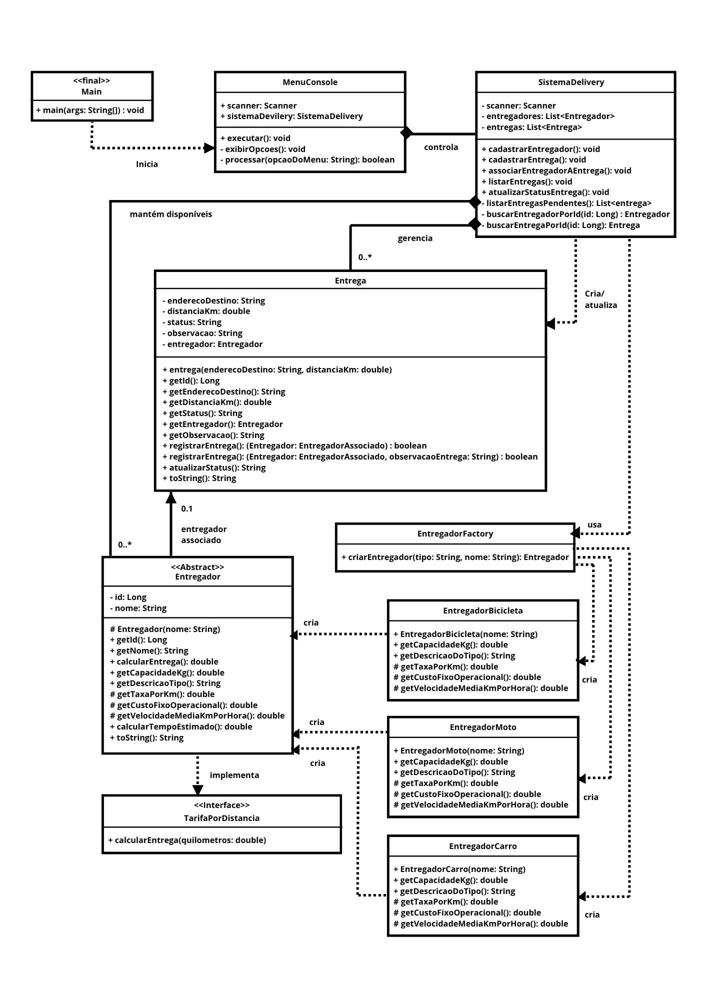

# cp2-ddd-java

**Sistema de Logística para Entregas (E-commerce)** — CP2 **Domain Driven Design** / **POO** (FIAP / 2ESPY).

Simular um serviço de logística de entregas (inspirado em marketplaces e e-commerce), com foco em **modelagem orientada a objetos**: entregadores com comportamentos distintos, entregas com status, atribuição e acompanhamento do fluxo operacional.

## Integrantes do Grupo

- Beatriz Cortez — 561431
- Bruno Alves — 563986
- Gabriel Augusto — 564126
- Davi de Jesus — 566316


## Java (SDKMAN)

O arquivo [`.sdkmanrc`](.sdkmanrc) fixa o JDK deste projeto. Com [SDKMAN](https://sdkman.io/) instalado, na raiz do repositório:

```bash
sdk env
java -version
```

Se essa distribuição ainda não estiver instalada:

```bash
sdk install java 21.0.2-open
sdk env
```

## Como executar

O código usa sintaxe compatível com **Java 21+** (por exemplo *text blocks* e *switch* com setas). Na raiz, use o JDK aplicado pelo passo anterior:

```bash
sdk env
mkdir -p out
find src -name "*.java" -print0 | xargs -0 javac -d out -encoding UTF-8
java -cp out com.cp2.logistica.Main
```

Ou abrir o projeto na IDE com **source root** em `src` e executar **`com.cp2.logistica.Main`**.

## Explicação do sistema

A aplicação roda por **`Main`** → **`MenuConsole`** → **`SistemaDelivery`**, com entrada via **`Scanner`**. O domínio fica em **`com.cp2.logistica.domain`**.

Funcionalidades principais:

| Opção | Ação |
|------:|------|
| **1** | Cadastrar **entregador** (tipo: bicicleta, moto ou carro) |
| **2** | **Criar entrega** com endereço e distância (km)|
| **3** | **Associar** entregador disponível a uma entrega **PENDENTE**; exibe tempo estimado (minutos) e valor estimado (tarifa) |
| **4** | **Listar** entregas |
| **5** | **Atualizar status** da entrega (respeitando transições válidas no domínio) |
| **0** | Sair |


---

## Diagrama de Classes UML



## Perguntas discursivas

### 1. Herança: como foi utilizada no sistema? Qual problema resolveu e quais classes estão envolvidas?

A herança foi aplicada para construir uma especialização de tipos de entregadores. Resolveu o problema da duplicação de código e 
possibilitou o polimorfismo. Em vez de repetir campos (ID, nome) e lógica de cálculo de tempo ou sobreposição de texto em todo tipo 
de entregador, abstraímos tudo em um único lugar. O sistema principal trata qualquer entregador genericamente, sem se importar com 
seu tipo exato no momento de atribuir a entrega.

As classes envolvidas são:
- Superclasse: Entregador
- Subclasses (Filhas): EntregadorBicicleta, EntregadorMoto e EntregadorCarro.

### 2. Interfaces: qual interface foi criada? Por que foi utilizada e qual vantagem trouxe?

Foi criada a interface TarifaPorDistancia. Ela foi utilizada para estabelecer um contrato em que qualquer classe que a implemente é 
obrigada a fornecer a lógica do método calcularEntrega(double quilometros). A vantagem é o baixo acoplamento e a padronização de 
comportamento. Se no futuro o sistema precisar calcular tarifas de um provedor externo (como "Correios"), essa nova classe só precisa 
assinar a interface TarifaPorDistancia, e o sistema continuará sabendo calcular a taxa sem ficar acorrentado apenas à hierarquia de 
entregadores.

### 3. Classe abstrata: qual o papel da classe abstrata? Por que não poderia ser uma classe “comum”?

A classe abstrata Entregador atua como um molde e organiza a lógica comum de todos os entregadores. Ela dita a "estrutura" de como os 
custos e tempos são calculados por métodos concretos (como calcularEntrega e calcularTempoEstimado), mas obriga as subclasses a 
preencherem valores específicos através dos métodos abstratos (getCapacidadeKg, getTaxaPorKm, getCustoFixoOperacional, etc).

Se fosse uma classe comum (concreta), o Java permitiria criar instâncias genéricas usando new Entregador("João"). Porém, dentro do 
contexto/domínio desse software de logística, não existe um entregador genérico. Todo entregador necessariamente precisa 
estar operando um veículo (bicicleta, moto ou carro) para podermos saber sua velocidade média, capacidade de carga e taxas. Torná-la 
abstrata protege a modelagem do domínio, impedindo a criação de representações inválidas ou incompletas no sistema.